# esirgeyen ve bağışlayan ❤️ Allah'ın (c.c) adıyla - 12
This is a React fundamentals notes focused on flow of the react app, commands, technology stack used in react, files and folder structure, testing and CLI

## Table of Contents
- [1_Background](#1_Background)
    - [SPA](#SPA)
    - [Server Side Application](#Server-Side-Application)
- [2_Description](#2_Description)
    - [manipulating_dom_elements_efficiently](#manipulating_dom_elements_efficiently)
    - [async_operations](#async_operations)
    - [components](#components)
        - [function_vs_class_components](#function_vs_class_components)
        - [nested_components](#nested_components)
        - [custom_components](#custom_components)
- [3_Setup](#3_Setup)
    - [1_CRA_depreciated](#1_CRA_depreciated)
        - [why_do_not_use](#why_do_not_use)
    - [2_vite](#2_vite)
        - [setup_Vite_project_with_CLI](#setup_Vite_project_with_CLI)
        - [setup_Vite_project_with_Intellij](#setup_Vite_project_with_Intellij)
        - [Start the development server](#start-the-development-server)
    - [3_full_stack_react_framework_setup](#3_full_stack_react_framework_setup)
- [4_Project Folder Structure](#4_Project-Folder-Structure)
    - [standard_subdirectories_to_create](#standard_subdirectories_to_create)
    - [files to create](#files_to_create)
        - [app_jsx](#app_jsx)
        - [index_css](#index_css)
        - [app_css](#app_css)
- [5_Available Scripts](#5_Available_Scripts)
- [6_TDD](#6_TDD)
    - [description](#description)
    - [install_configuration](#install_configuration)
    - [adding_new_tests](#adding_new_tests)
    - [screen](#screen)
    - [categories_of_query_types](#categories_of_query_types)
- [7_Bindings_Props_State_and_Events](#7_Bindings_Props_State_and_Events)
    - [Props](#props)
    - [State](#state)
    - [Hooks](#hooks)
   


## 1_Background
### SPA
- React is a framework released by Facebook for creating `SPA(Single Page applications`
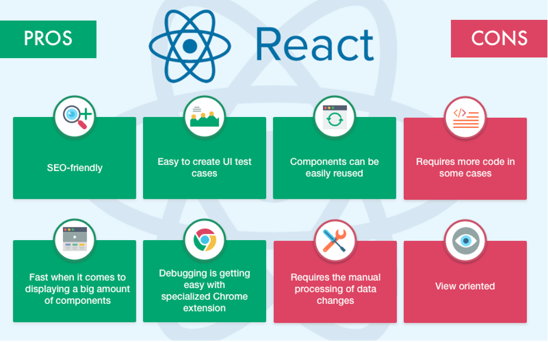
- It is an open-source JavaScript library used to create user interfaces`(view layer of a Model View Controller (MVC) architecture)` 
- It is used to create modular user interfaces and promotes the development of `reusable UI components` that display dynamic data.
### Server Side Application
- Most web applications traditonally `Server Side Applications`. The server holds the business logic, stores data and 
renders the website to the client. When client clicks on a link, it sends a request to the server, and 
the server will handle the this request and send back a response with `html code` which the browser will render and be viewed by the user
- The problem here is that with this approach, server receives a lot of requests
    - when we click on `Home page`, `About page`, `Blog`; Server Side Applications consist of independent HTML pages and
  when a user navigates these pages, the browser would request and load different HTML documents.
    - too many requests, responds  bring upon a lot of time and resources spent on these tasks lead to a slow feeling of web pages
<!--###############################-->

## 2_Description
 - In React, we don't always have to load new pages each time there is an action from the user. A user still clicks on variuos links in a SPA. However, this time, the client handles the requests on its own and will re-render the html page through Javascript so the `server is left out here`, unless data from the server is needed. This is much faster as we don't need to send data over the Internet.
 - The `client` doesn't have to wait for the response, and the `server` doesn't have to render the response

### manipulating_DOM_elements_efficiently
- Loading and unloading different views of the same page involve querying and manipulating DOM elements.
Such `DOM operations` involve `adding children, removing subtrees and can be really slow.` This is where React addresses this
shortcoming in `manipulating DOM elements efficiently`. React does this by updating the browser DOM for us.
- With React, we don't interact with the DOM directly. Instead, we interact with a `virtual DOM` which React uses to construct the actual DOM
The virtual DOM is made up of React elements (which we specify in `JSX`) which 
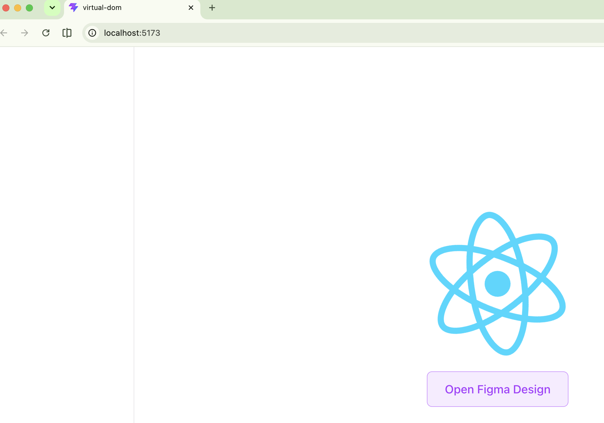


look similar to HTML elements but are
actually `Javascript objects`. It is much faster to work with Javascript objects than the DOM API directly.
- We make changes to the Javascript object (the virtual DOM) and `React renders` those changes for us

### async_operations
- When we do make server requests, we do it asynchronously, which means we `re-render the page instantly to the user` and 
then wait for the new data to arrive and incorporate it and re-render only the required view 
when the data arrives thus providing a fluid experience.
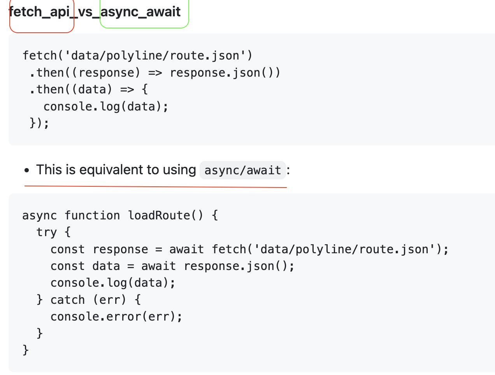

### components
- React apps are made out of `components`. A component is a piece of the UI (user interface)
that has its own logic and appearance.  A component can be as small as a button, or as 
large as an entire page.

- In more technical terminology; a React `component` is a class that contains a 
`JSX template` that ultimately outputs HTML elements. It has it is own data and logic to control the JSX template
- React component names must always start with a `capital letter`

#### function_vs_class_components
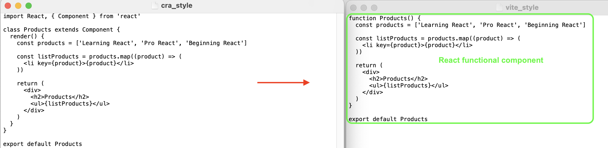

Since Vite projects leverage `modern React (versions 18 and 19)`, we will almost exclusively write `function components`

#### nested_components
- `App.jsx (Root component)` and components can also contain other components. 
For example, in `products component` where we display a list of products,
 we do so using multiple `product` components. Also, in each `product` component, we can have a `rating` component

#### custom_components
- 1- create custom functional component `Products.jsx`
- 2- import it into `App.jsx`.  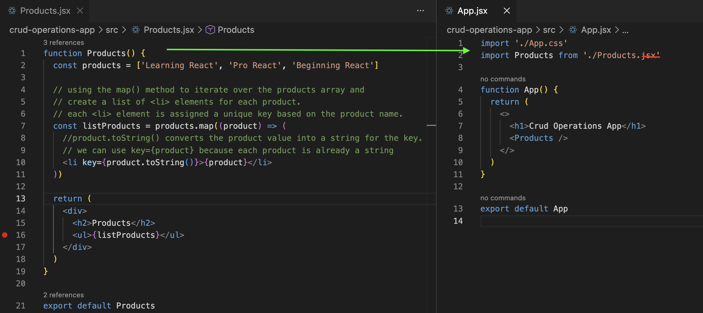

Because `Products.jsx` is in the same src folder, Vite resolves the extension automatically.
<!--###############################-->

## 3_Setup 
### 1_CRA_depreciated
- `npx create-react-app my-app`
The React documentation now recommends using modern frameworks or build tools instead.

#### why_do_not_use
CRA has several drawbacks compared to newer tooling:

- Slower development server and builds.
- `Webpack` configuration is difficult to customize.
- Less active maintenance.
- Doesn't take advantage of modern bundlers like `Vite`
- Lacks built-in support for features such as `server-side rendering (SSR)` and `React Server Components.`
### <span style="color: green;">2_vite </span>

#### setup_Vite_project_with_CLI
- `Vite` is a build tool that aims to provide a faster and leaner development experience for modern web projects.
- Prefer kebab-case (my-app) for the project/package name — it’s the most compatible convention.

- `npm create vite@latest crud-operations-app`

- ✔ Select a framework: React
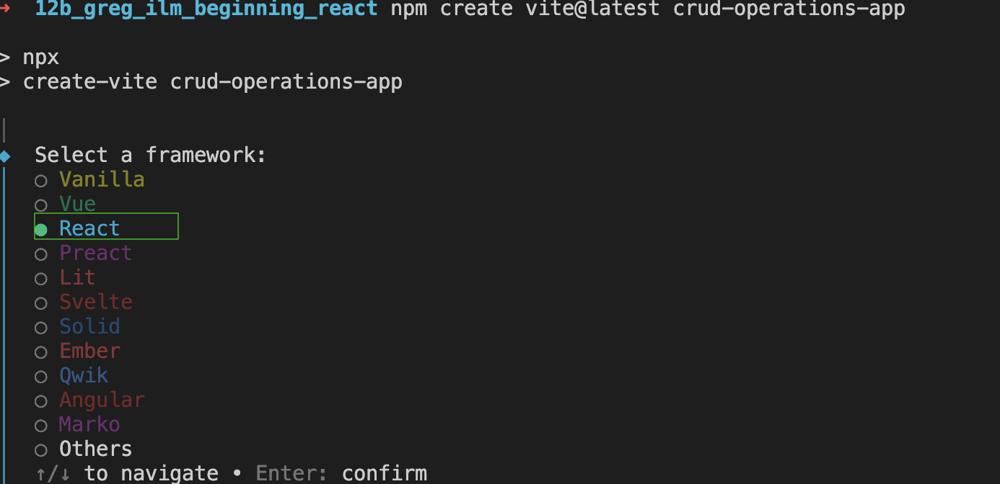
- ✔ Select a variant: JavaScript (or TypeScript)
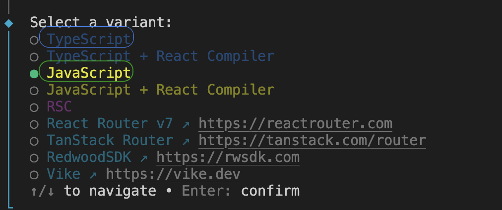

This will create our React project folder in the directory with two dependencies. 
 ```
  "dependencies": {
    "react": "^19.2.7",
    "react-dom": "^19.2.7"
  },
``` 
#### setup_Vite_project_with_Intellij
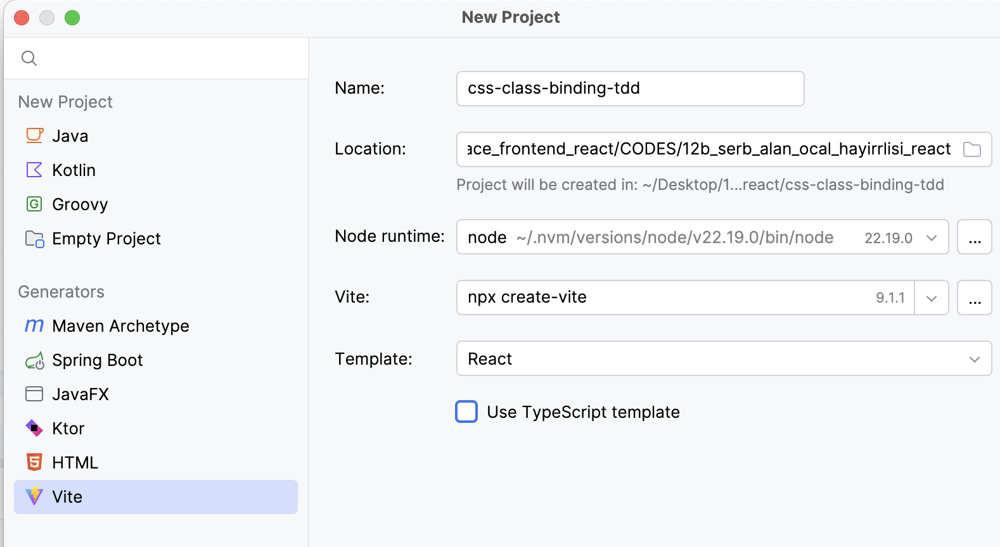
#### Start the development server
- `npm run dev`
- http://localhost:5173/ 
- 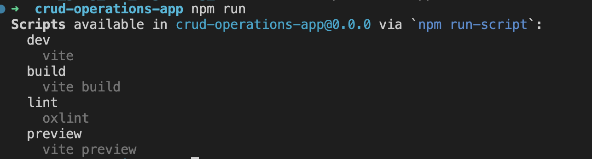
- 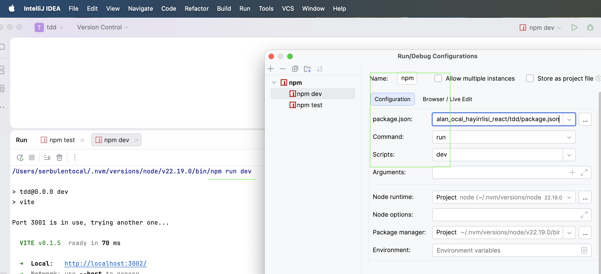
### 3_full_stack_react_framework_setup
`npx create-next-app@latest`
`npm run dev`
`npx create-react-router@latest`
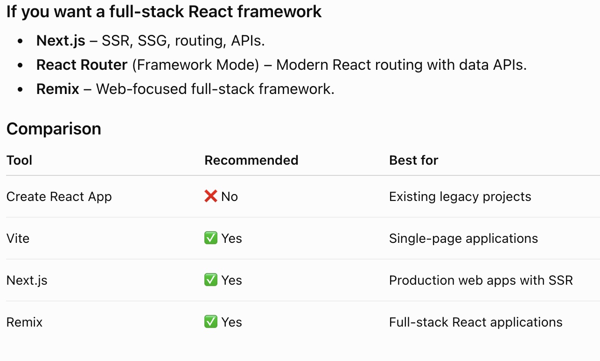
<!--###############################-->

## 4_Project Folder Structure 
In React, `organizing the src folder with subdirectories` is a standard practice to keep code maintainable as the project grows. While there is no "official" mandatory structure, several industry-standard patterns exist for grouping files. 

### standard_subdirectories_to_create
Common subdirectories often added to the src folder include:
- `assets/`: Contains static files such as images, logos, icons, and global CSS.

- `pages/ (or views/`): Groups components that represent entire routes or views (e.g., Home.js, About.js).

- `hooks/`: Reserved for custom React hooks (e.g., useAuth.js, useFetch.js).
    - Hook is an innovation that drives functional components into areas of activities previously monopolized by their class counterparts
    - `useState` hook revolutionises state management within these components, presenting them with dynamic attributes that are filled accross the application

- `utils/ (or services/)`: Holds helper functions, API call logic, and formatting utilities.

- `context/`: Contains Context API files for global state management. 

### files_to_create
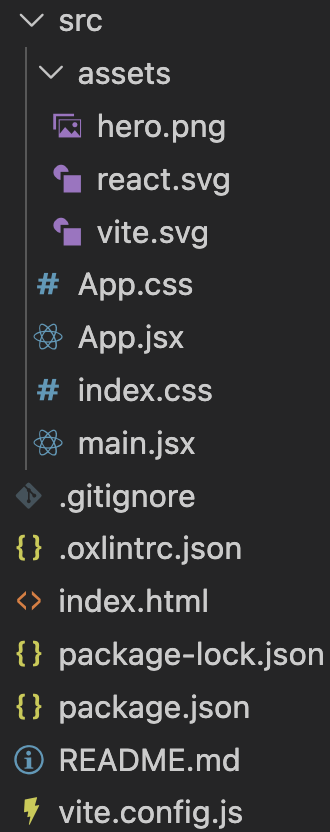
- node_modules          // the folder is created by Node.js
                        // and puts all `third party moudules (dependencies)` listed in `package.json`
- index.html — Vite entry HTML file                        
- src/
    - ├── main.jsx      // Entry point
    - ├── App.jsx       // Root component
    - ├── index.css     // Global styles
    - ├── App.css       // Component-specific styles for the App component

- package.json          // is the node package configuration that lists
                        // the third party packages our project uses
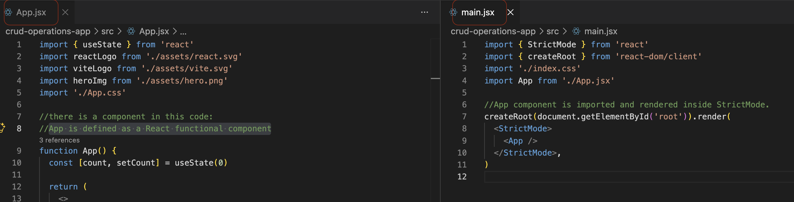

#### app_jsx
- Every React application has at least one component, the `root component`: `React functional component named App in App.jsx`
- React converts this JSX into React elements and ultimately `renders them into the DOM element with 
`id="root" from src/main.jsx`.
- 
```
function App() {
  return (
    <>
      {/* UI elements */}
    </>
  )
}
```
- In `App.jsx`, `className` is how you assign CSS classes to an element. It maps to the HTML class attribute when the element is rendered.
    - Example:
    `<div className="hero">...</div>`
    - This renders to:
    `<div class="hero">...</div>`
    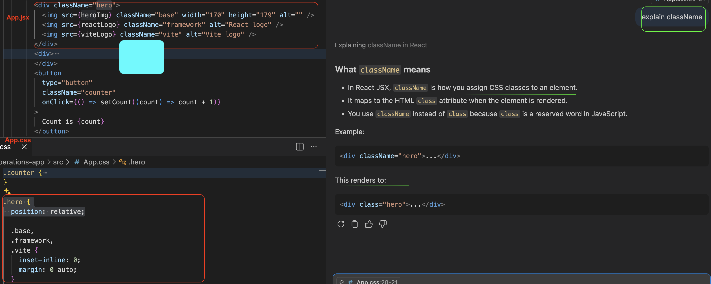
#### index_css  
- Global styles for the entire application
- Applied to the root HTML file (usually `index.html`)
- Typically contains:
   - Reset/normalise styles (margins, paddings, font defaults)
   - Global colour schemes and typography
   - Base HTML element styles
   - CSS variables or theme definitions
- Loaded once when the app initialises
- `Affects all components across the app`
#### app_css
- Imported directly into the `App.jsx component`
- Typically contains:
    - Layout styles for the App component structure
    - Styles specific to that component's UI
    - Component-level customizations
    - `Only applies to elements within the App component`
<!--###############################-->

## 5_Available_Scripts
- `npm run dev` - Start development server with HMR
- `npm run build` - Build for production

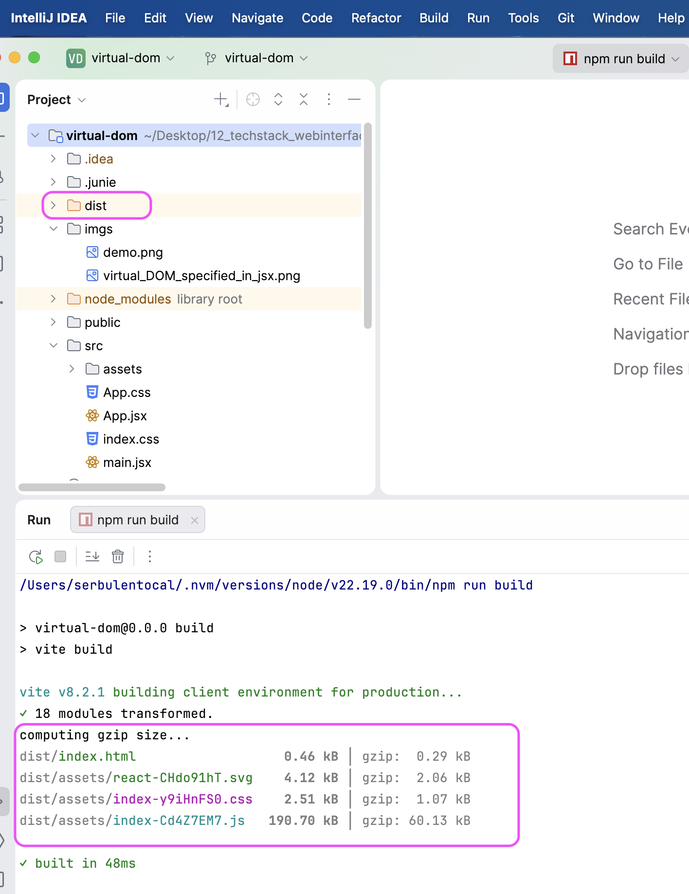
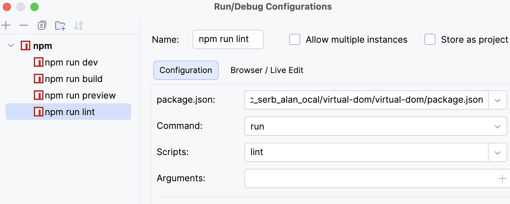

- `npm run preview` - Preview production build locally
- `npm run lint` - Run Oxlint code quality checks
<!--###############################-->

## 6_TDD 
### description
- TDD in React uses the `Red–Green–Refactor` cycle applied to `components, hooks, and interactions` — we write a test that expresses the desired behavior before writing the `component code`, implement the minimal code to make the test pass, then refactor with confidence

- A good fit is `Vitest` with `React Testing Library`: Vitest runs naturally with Vite, while Testing Library verifies what users see rather than implementation details. 

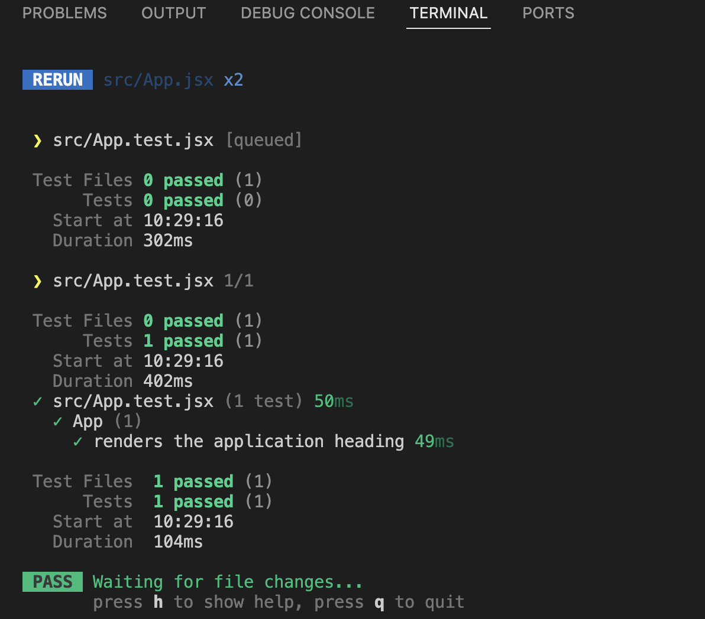
### install_configuration
- 1- adding the test dependencies
`npm install -D vitest jsdom @testing-library/react @testing-library/jest-dom`
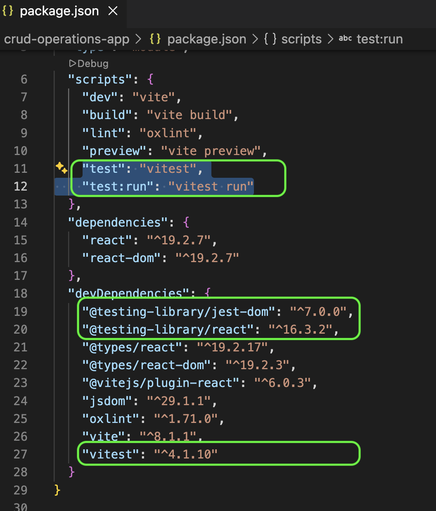
- 2- configuration
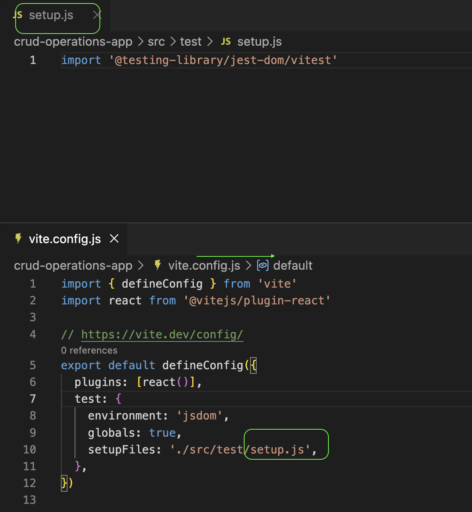
- 3- - `npm test` - Run tests in watch mode
     - `npm run test:run` - Run tests once (CI mode)
### adding_new_tests
Create a new `*.test.jsx` file in the `src` directory and follow this pattern:
```jsx
import { render, screen } from '@testing-library/react'
import { describe, expect, it } from 'vitest'
import Component from './Component'

describe('Component', () => {
  it('should render something', () => {
    render(<Component />)
    expect(screen.getByText('text')).toBeInTheDocument()
  })
})
```
- ### screen
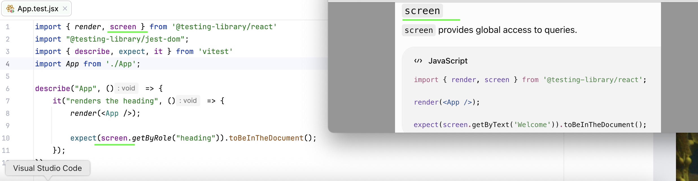
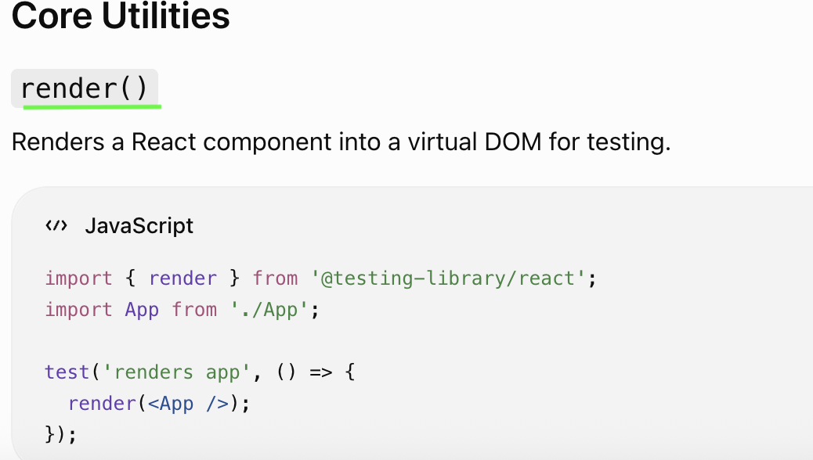

### categories_of_query_types
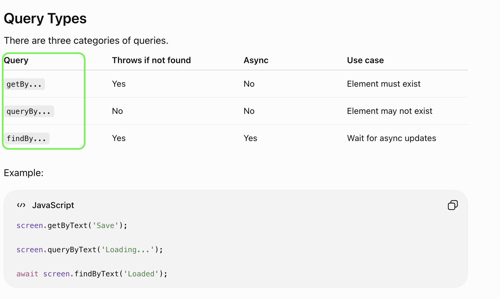
<!--###############################-->

## 7_Bindings_Props_State_and_Events 
### Props
- `Props` are like arguments we pass to a function. They let a parent component pass data to a child component and customize its appearance. For example, a Form can pass a color prop to a Button.

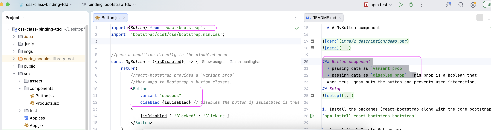
-button to be reusable with different styles, by making it accept a `className prop`:
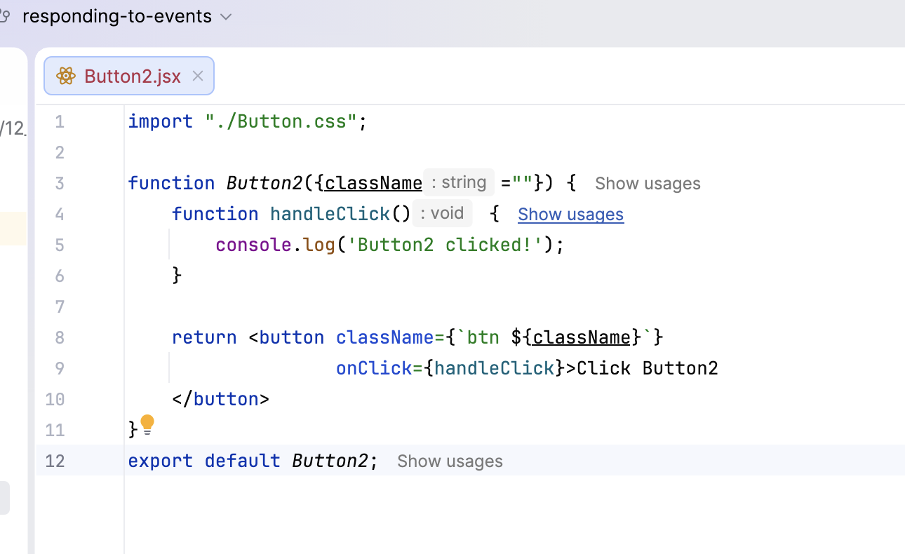

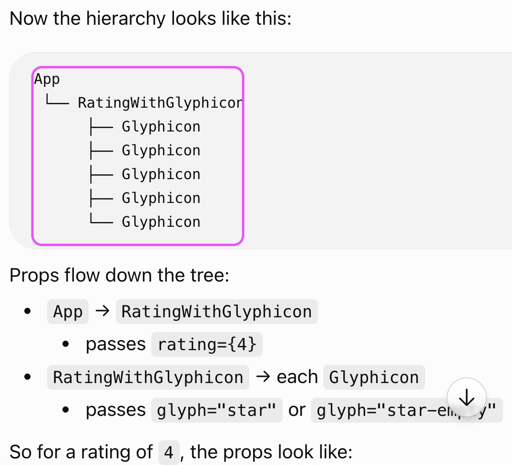
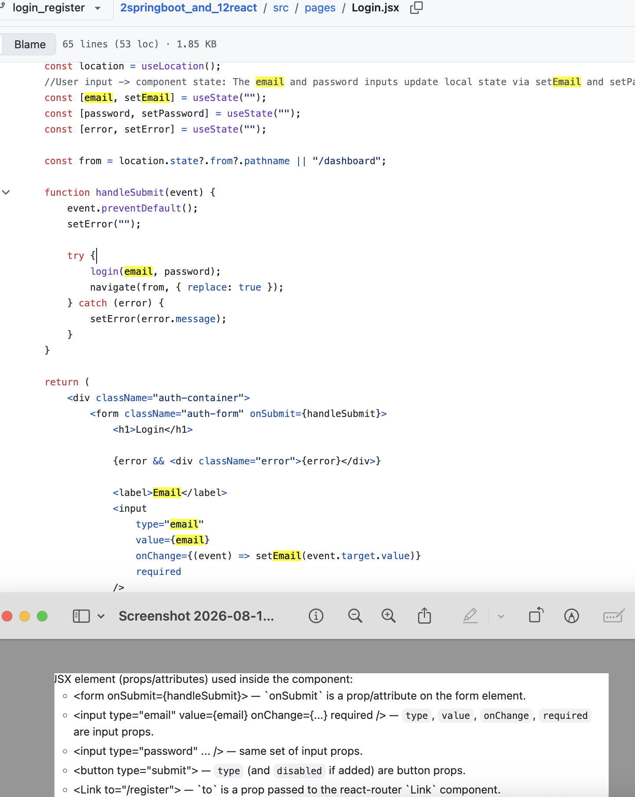


- **data exchange fostered through props**
- Keys: data transportation, responsive user interaction, prop drilling (a methodology where props navigate through numerous layers)
- It starts with declaration of a function or class-oriented components. Instead of separating the markup(HTML) and logic(JS) in separate files, React uses <span style="color: green;">components </span>for this purpose.

### State
- 
```
[something, setSomething]
const [count, setCount] = useState(0);
```
- `State` is like a component’s memory. It lets a component keep track of some information and change it in response to interactions.
 For example, a Button might keep track of `isHovered state`. State is reserved only for interactivity, that is, `data that changes over time`
[state](imgs/7_bindings_props_state_and_events/prop_example6.png)

### Hooks
- Functions starting with `use are called Hooks`. `useState` is a built-in Hook provided by React
- React provides a special function called `useState` that we can call from our component to let it “remember” things.
- `useState` is used for `fetching and displaying data` and stores data that affects rendering.


