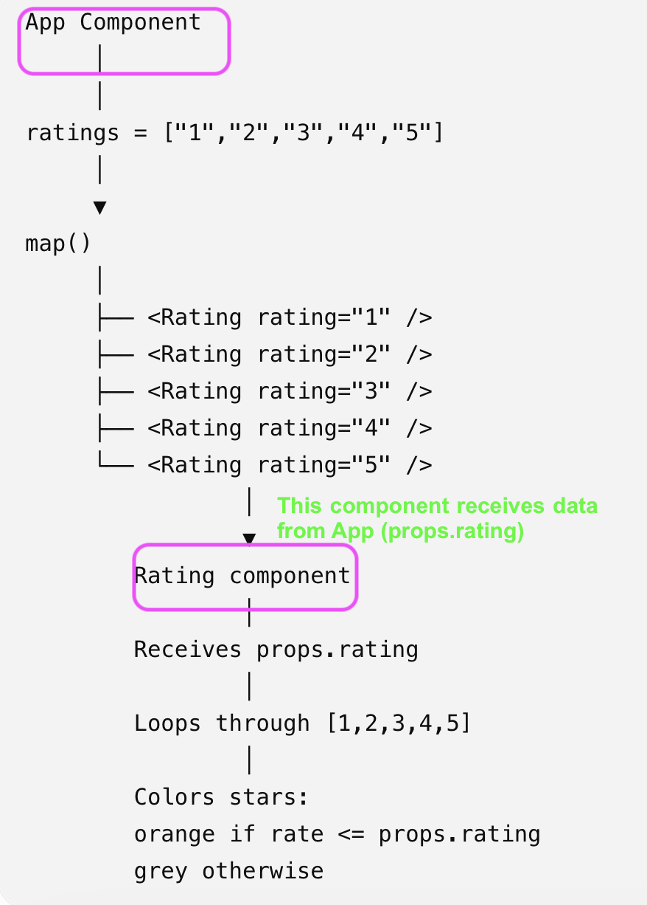
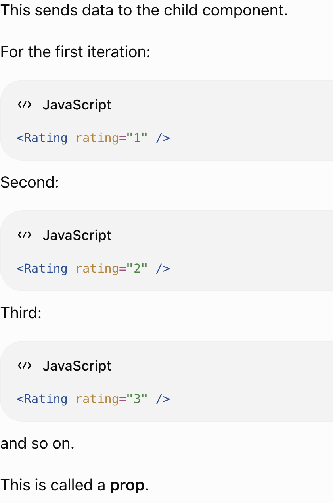
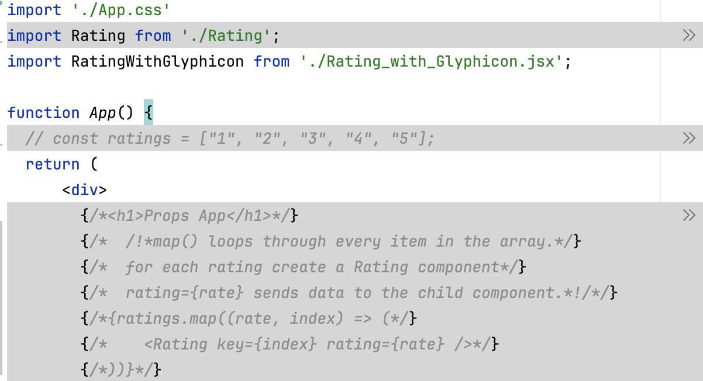
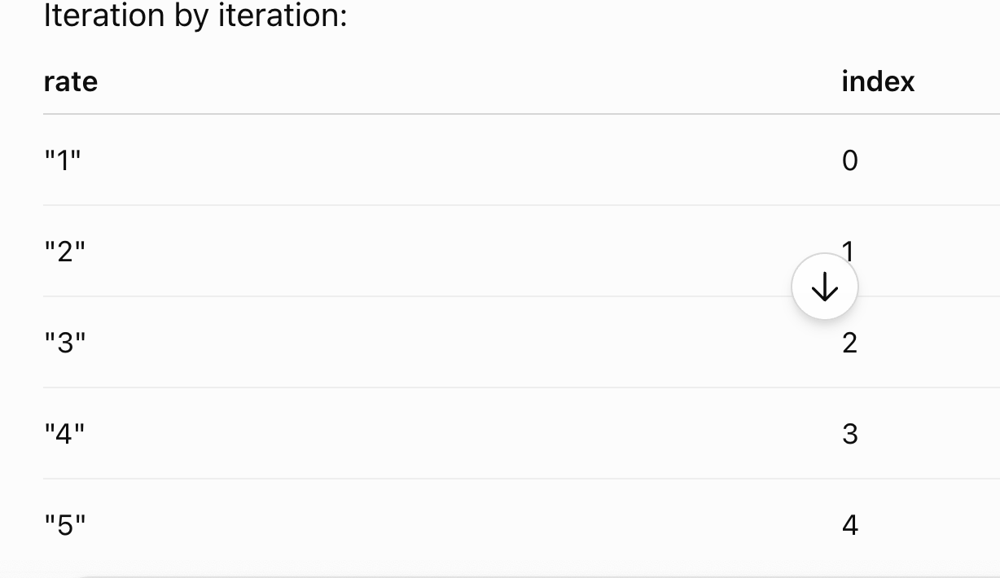
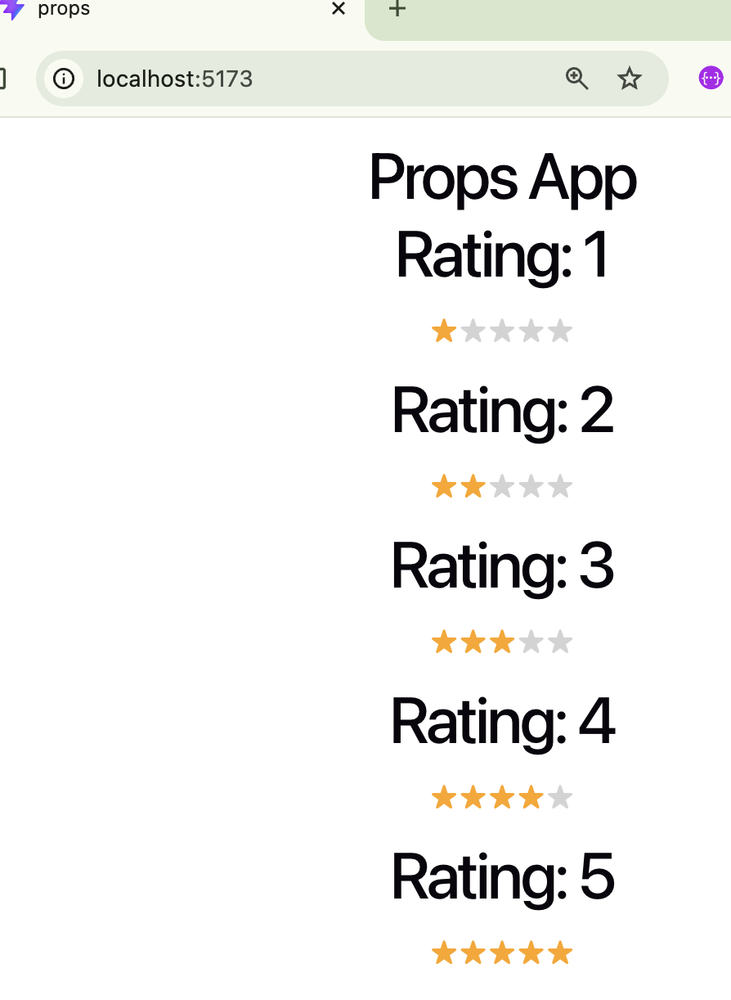
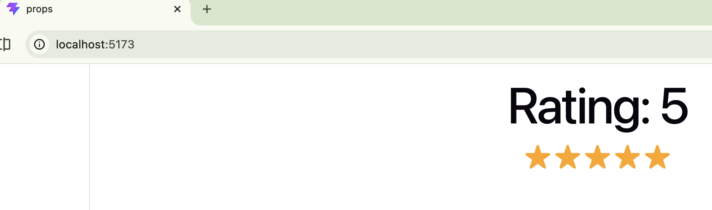

# esirgeyen ve bağışlayan ❤️ Allah'ın (c.c) adıyla - 12b_greg_limm
## Initial Application
- `Components`: App is the parent; Rating is the child
- 

- `Props`: Data flows from parent to child using rating={rate}. Props are read only
- 

- 
- 

- 

## Second Application

- `Glyphicon`: RatingWithGlyphicon renders (uses) the Glyphicon component.
  Data_flow_Glyphicon
- 

- 