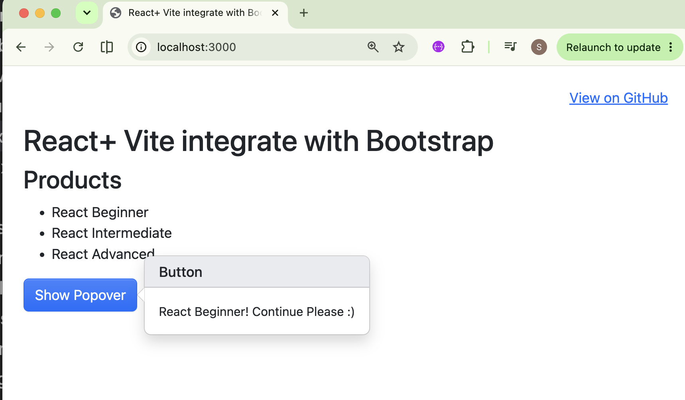
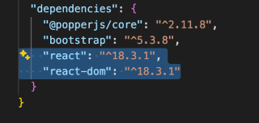
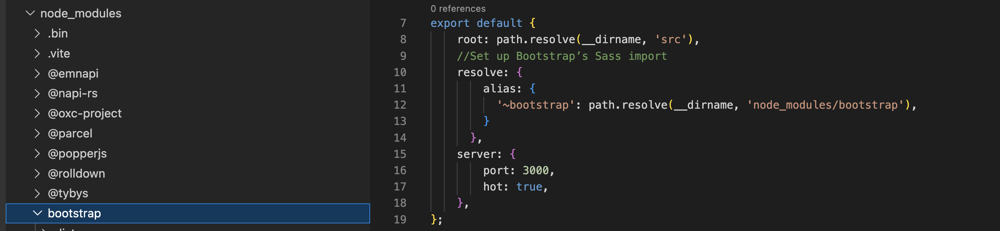
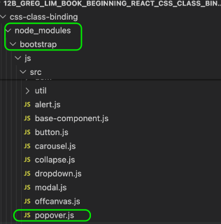
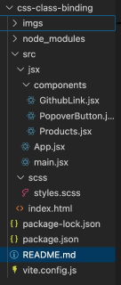

# esirgeyen ve bağışlayan ❤️ Allah'ın (c.c) adıyla - 12b_greg_lim_book_beginning_react_css_class_binding

## Table of Contents
- [Description](#description)
- [Setup](#setup)
- [Adding Components](#adding-components)
   - [PopoverButton](#popoverbutton)
- [Instructions](#Instructions)
- [Project Folder Structure](#Project-Folder-Structure)
- [Keywords](#keywords)


## Description
CSS class binding + Bootstrap + Vite example to render the `heading, product list plus the button`


## Setup
- mkdir {src,src/jsx,src/scss}
- touch src/index.html src/jsx/main.jsx src/scss/styles.scss vite.config.js
 
## Adding Components
    - src touch App.jsx 
    - src touch Product.jsx
    - src touch GithubLink.jsx
    - src touch PopoverButton

### PopoverButton
- React renders in this order:
   1. Call PopoverButton()
   2. Create JSX
   3. Put JSX into the browser
   4. Run useEffect() - useEffect guarantees that the DOM already exists.
                      -  the below code means `run after every render.`
      ```
      useEffect(() => {
         ...
      });
      ```
- button `doesn't exist` until step 3.
- js `buttonRef.current` becomes ->  HTML `<button class="btn btn-primary"> Show Popover </button>`
- buttonRef
    |
    +---- current ----> <button>

User opens page
↓

PopoverButton appears
↓

Bootstrap creates popover
↓

User navigates away
↓

PopoverButton disappears
↓

cleanup runs
↓

popover.dispose()
## Instructions
- First, It's loaded up with `Bootstrap 5 and uses Vite` to compile and bundle `Sass and JavaScript` by using the original reference:
   - ref: https://getbootstrap.com/docs/5.2/getting-started/vite/

- Second, Javascript files are transformed into JSX to use React. For this purpose, `React dependencies` have been added
   

- Third,  Bootstrap’s Sass import is set up  in `vite.config.js.` and  load the CSS and import Bootstrap’s JavaScript in `main.jsx`
   
- For example; `PopoverButton component` imports `Popover.js from Bootstrap`
  


- Fourth, the `js files have been converted to jsx`
- Fifth, a reusable Popover component is created for the `Button` 

## Project Folder Structure



## Keywords
- from PopoverButton
   - `useRef` → stores a value or DOM element without causing re-renders.
   - `useEffect` → performs side effects after rendering (fetch data, initialize - Bootstrap, start timers, subscribe to events, etc.).
   - `[]` → "Run this effect once when the component is mounted."