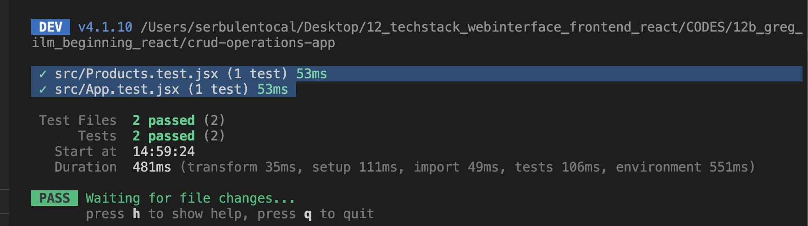

# esirgeyen ve bağışlayan ❤️ Allah'ın (c.c) adıyla - 12b_greg_lim_book_beginning_react

## Table of Contents
- [Description](#description)
- [Prerequisites](#prerequisites)
- [Technology Stack](#technology-stack)
- [Installation](#installation)
- [Available Scripts](#available-scripts)
- [Architecture](#architecture)
- [Testing](#testing)
   - [Running Tests](#running-tests)
   - [Test Files](#test-files)
   - [Test Coverage](#test-coverage)
   - [Adding New Tests](#)

## Description
This is a React practice project that demonstrates building a product listing application with React and Vite. 

## Prerequisites
- Node.js (v22.19.0)
- npm (v10.9.3)
## Technology Stack
- **React** 19.2.7
- **Vite** 8.1.1
- **Vitest** - 4.1.10 Test runner
- **React Testing Library** - Testing utilities
   - `React Testing Library (RTL)` is the de facto standard library for testing React components.
   - By using `Jest`, we are importing the custom matchers in our setup file `setup.js`:
- **Oxlint** - 1.71.0 Code quality linting 
## Installation
1. setup_Vite_project:
`npm create vite@latest crud-operations-app`
- ✔ Select a framework: React
- ✔ Select a variant: JavaScript

2. Start the development server:
`npm run dev`
- The application will run with Vite HMR (Hot Module Replacement) enabled for fast development.
## Available Scripts
- `npm run preview` - Preview production build locally
- `npm run lint` - Run Oxlint code quality checks
- `npm test` - Run tests in watch mode
- `npm run test:run` - Run tests once (CI -Continuous Integration mode)
## Architecture
The application is built using component-based architecture:

### Components
- **App** - Main application component that displays the title and renders the Products component
- **Products** - Displays a list of available products
## Testing
This project uses **Vitest** and **React Testing Library** for component testing.
### Running Tests
```
- npm install -D vitest jsdom @testing-library/react @testing-library/jest-dom` # adding the test dependencies
- npm test              # Watch mode
- npm run test:run      # Single run (CI)
```

### Test Files
- `src/App.test.jsx` - Tests for the App component
- `src/Products.test.jsx` - Tests for the Products component

### Test Coverage
- `App component` renders the application heading
- `Products component` displays all products correctly



### Adding New Tests
Create a new `*.test.jsx` file in the `src` directory and follow this pattern:
```jsx
import { render, screen } from '@testing-library/react'
import { describe, expect, it } from 'vitest'
import Component from './Component'

describe('Component', () => {
  it('should render something', () => {
    render(<Component />)
    expect(screen.getByText('text')).toBeInTheDocument()
  })
})
```


