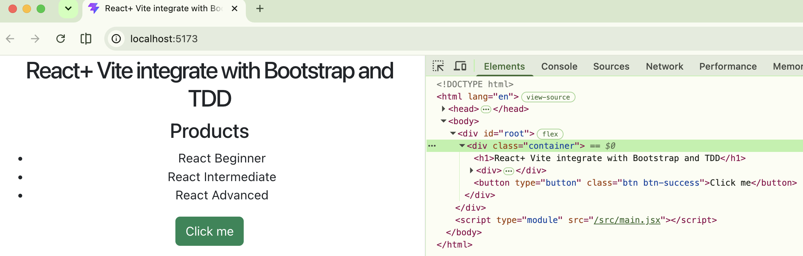
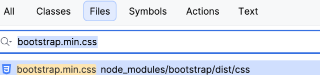
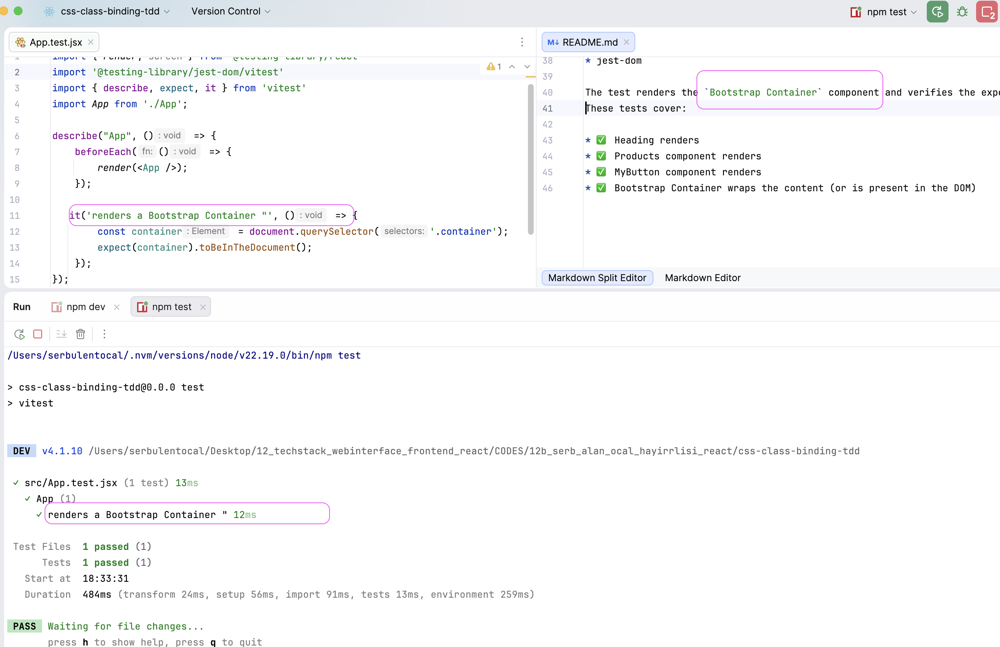

# esirgeyen ve bağışlayan ❤️ Allah'ın (c.c) adıyla - 12c_serb_alan_ocal_hayirlisi_css-class-binding-tdd

## Table of Contents
* [Description](#description)
  * [Button component](#button-component)
* [Setup](#setup)
* [Testing](#testing)

## Description
- This is a simple React application created with **Vite**. It demonstrates how to:
  * use **Bootstrap** for `Container and Button` as React components
- App component renders three things:
  * A Container from react-bootstrap
  * A Products component
  * A MyButton component

### Button component
  * passing data as `variant prop` 
  * passing data as `disabled prop`. This prop is a boolean that, 
  when true, gray-outs the button and prevents user interaction.
## Setup

1. Install the packages (react-bootstrap along with the core bootstrap package)
`npm install react-bootstrap bootstrap`

2. Import the CSS into Button.jsx
   * Bootstrap's compiled CSS: import 'bootstrap/dist/css/bootstrap.min.css'; in Button.jsx.

3. Adding test dependencies manually into `package.json`
    *    "test": "vitest"
    *    "test:run": "vitest run"
## Testing
The project uses:

* React Testing Library
* Vitest
* jest-dom

The test renders the `Bootstrap Container` component and verifies the expected as shown below:
These tests cover:

* ✅ Heading renders
* ✅ Products component renders
* ✅ MyButton component renders
* ✅ Bootstrap Container wraps the content (or is present in the DOM)

