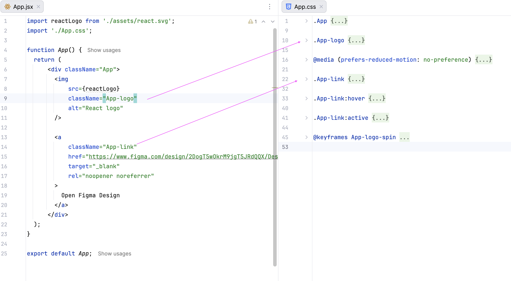
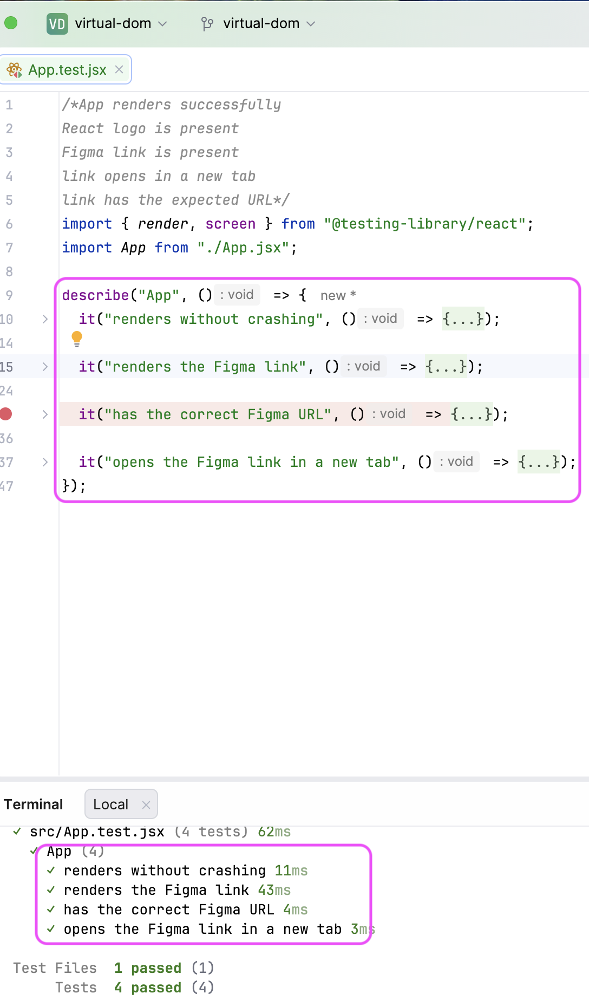

# Virtual DOM
A small React application built with Vite that displays the React logo and provides a link to the associated Figma design.

## Features
- React 19 app bootstrapped with Vite
- Simple UI showcasing the project entry point
- External link to the Figma design system

## Project Structure
- `index.html` — Vite entry HTML file
- `src/main.jsx` — React application bootstrap
- `src/App.jsx` — Main application component
- `src/App.css` — App-specific styling
- `src/assets/` — Static asset (react.svg) used by the app

## Tests

