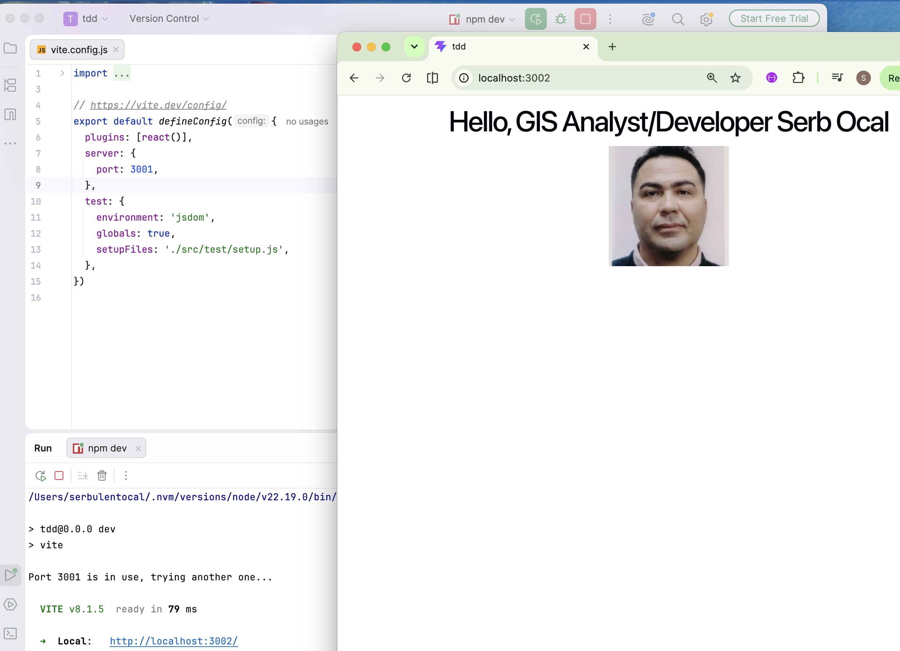
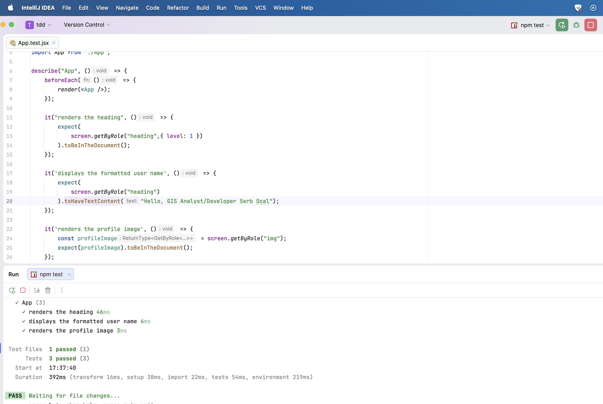

# esirgeyen ve bağışlayan ❤️ Allah'ın (c.c) adıyla - 12c_serb_alan_ocal_hayirlisi_react_tdd

## Sections
* [Description](#description)
* [Setup](#setup)
* [Project Structure](#project-structure)
* [Flow of the Program](#flow-of-the-program)
* [Testing](#testing)


## Description
This is a simple React application created with **Vite**. It demonstrates how to:

* Convert a React class component into a functional component.
* Replace traditional JavaScript functions with arrow function expressions.
* Pass multiple arguments into an arrow function.
* Render object data in JSX.
* Display an imported image.
* Write a basic component test using **React Testing Library** and **Vitest**.

The application `renders a heading containing a formatted user name and title, followed by a profile image`.
## Setup

### Create the project
```bash
npm create vite@latest tdd
```
### Install dependencies
```bash
npm install
```
### Start the development server
```bash
npm run dev
```


### Run the test suite
```bash
npm run test
```
## Project Structure
```
src/
├── assets/
│   └── profile.png
├── App.jsx
├── App.css
├── App.test.jsx
├── index.css
└── main.jsx
```

The application entry point renders the `App` component inside React's `StrictMode`.
## Flow of the Program
### Modify App.jsx

#### 1. Convert a class component into a functional component
Begin with a regular JavaScript function.
```jsx
function App() {

    function formatName(user) {

    }
}
```
#### 2. Convert the regular function into an arrow function
Traditional function:
```jsx
function formatName(user, title) {
    return `${title} ${user.firstName} ${user.lastName}`;
}
```
Arrow function:
```jsx
const formatName = (user, title) => {
    return `${title} ${user.firstName} ${user.lastName}`;
};
```

Since the function contains only a single expression, it can be shortened to:
```jsx
const formatName = (user, title) =>
    `${title} ${user.firstName} ${user.lastName}`;
```
This implementation is used in the application.


#### 3. Add a title
Create a title string and pass it to the formatting function.

```jsx
const title = "GIS Analyst/Developer";
```
The heading displays the title together with the user's full name.

#### 4. Add an image
Import the profile image.

```jsx
import profileImage from "./assets/profile.png";
```
Store it in the user object.

```jsx
const user = {
    firstName: "Serb",
    lastName: "Ocal",
    imageUrl: profileImage,
};
```
Render the image.

```jsx

```
The completed component imports the image, stores it in the user object, and renders it in JSX.
## Testing
The project uses:

* React Testing Library
* Vitest
* jest-dom

The test renders the `App` component and verifies the expected as shown below:



