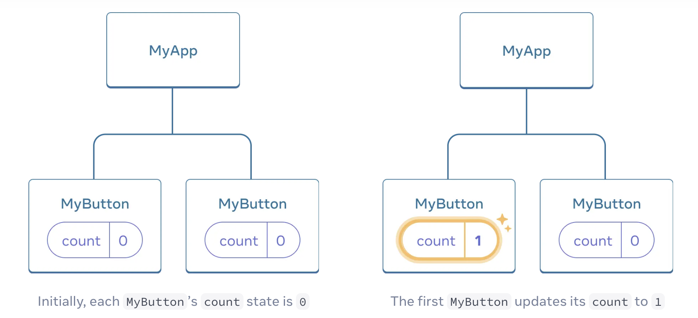
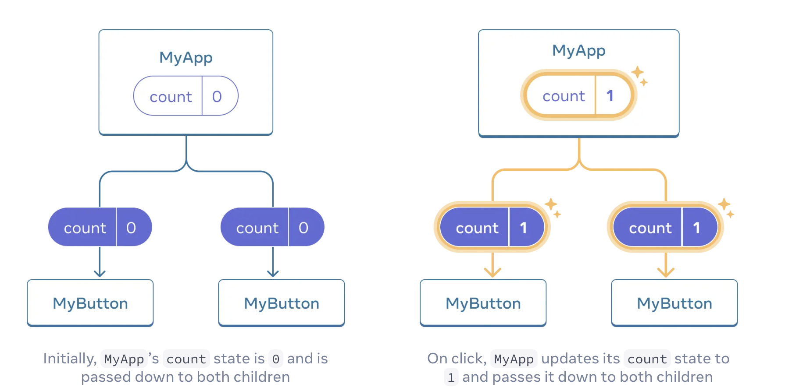
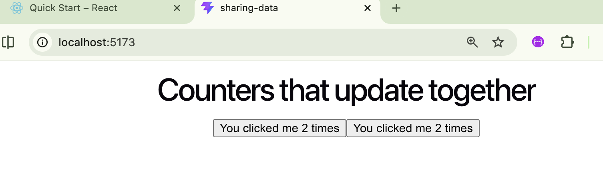

# esirgeyen ve bağışlayan ❤️ Allah'ın (c.c) adıyla - 12a_react_official
- 
- 
When we need components to share data, (e.g. to make both MyButton components display 
the same count and update together, we need to move the state from the individual buttons “upwards” 
to the closest component containing all of them. (e.g. MyApp)
- 

When we click either button, the count in MyApp will change, 
which will change both of the counts in MyButton.

* First, move the state up from MyButton into MyApp
* Then, pass the `state down from MyApp to each MyButton`, `together with the shared click handler.`
* Pass information to MyButton using the JSX curly braces, just like we previously did with
built-in tags like ``: The information we pass down like this is called `props`.