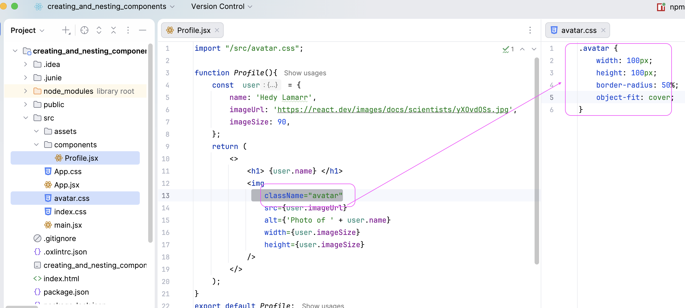

## Table of Contents
* [Description](#description)

## Description
- This is a simple React application created with **Vite**. It demonstrates how to display data and add styles:
   use **Css (avatar.css)** for `Profile` as a React component
- App component renders Profile
  
  

