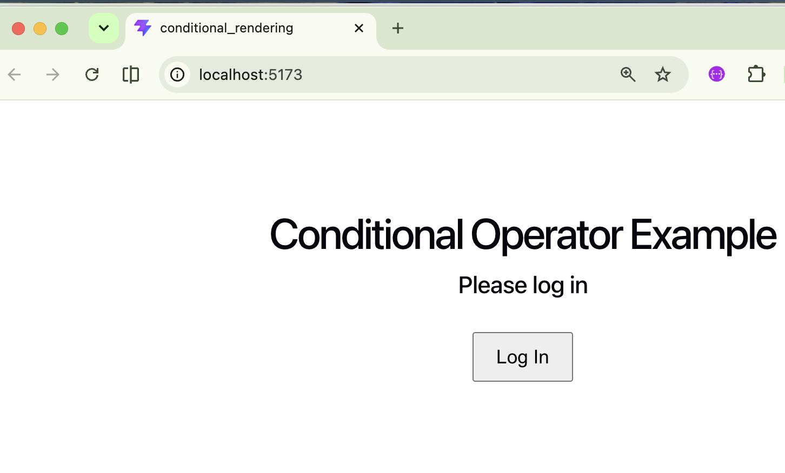
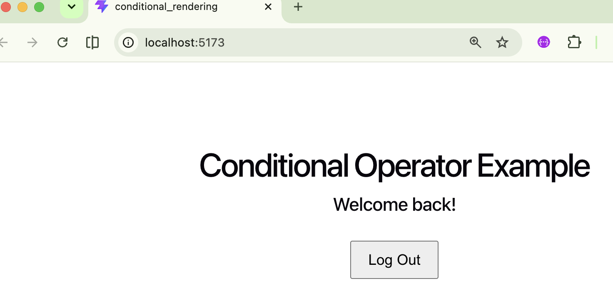
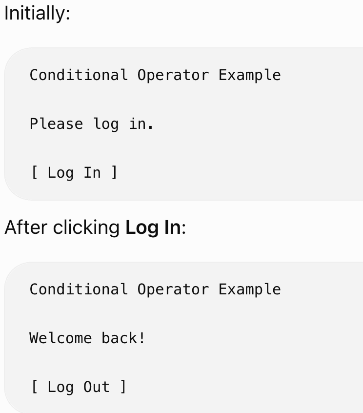

# esirgeyen ve bağışlayan ❤️ Allah'ın (c.c) adıyla - 12a_react_official

## Table of Contents
* [Description](#description)

## Description
This is a simple React application created with **Vite**. It demonstrates how to

- `conditionally render elements` with ternary operator based on certain conditions.
`condition ? valueIfTrue : valueIfFalse` 

- Examples:
* 1- h2 element uses `{isLoggedIn ? "Welcome back!" : "Please log in"}`
* 2- The button label uses `{isLoggedIn ? "Log Out" : "Log In"}`