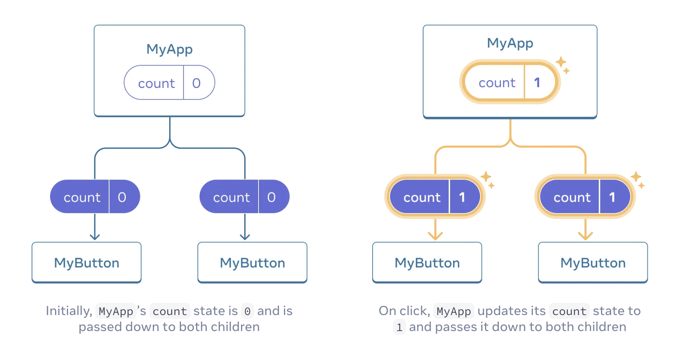

# esirgeyen ve bağışlayan ❤️ Allah'ın (c.c) adıyla - 12a_react_official

When I want my component to “remember” some information and display it, (e.g. count the number of times a button is clicked.)
I add state to my component.

