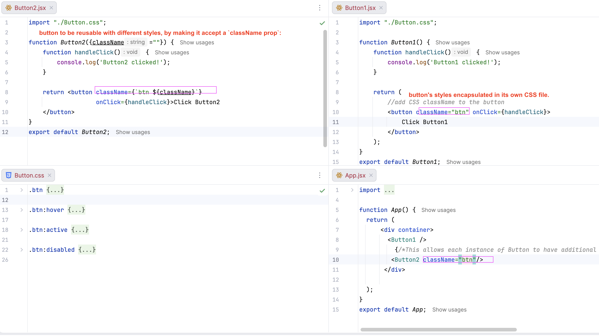

# esirgeyen ve bağışlayan ❤️ Allah'ın (c.c) adıyla - 12a_react_official

## Table of Contents
* [Description](#description)
* [CSS Styling in React](#css-styling-in-react)

## Description
In React, we can respond to user events such as `clicks`, `form submissions`, and `keyboard input`
by adding event handlers* to our components. e.g `<button onClick={handleClick}>`

Event handlers are functions that are called in response to an event. e.g
`onClick`, `onSubmit`, `onKeyDown`, `onKeyPress`, `onKeyUp`, `onChange`, `onFocus`, `onBlur`, `onMouseEnter`, `onMouseLeave`

As noticed  onClick={handleClick} has `no parentheses` at the end! We are
not calling the event handler function: we only need to `pass it down`.
React will call our event handler when the user clicks the button.

## CSS Styling in React
### Button1
-button's styles encapsulated in its own CSS file.
### Button2
-button to be reusable with different styles, by making it accept a `className prop`:

